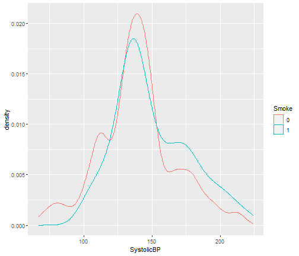
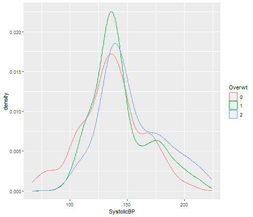

Blood Dataset
========================================================
author: Pablo Quicios Asenjo
date: 
autosize: true
font-import : http://fonts.googleapis.com/css?family=Helvetica
font-family: "Helvetica"
css: spec.css

Brief Description
========================================================
type: exclaim
transition: fade
transition-speed: slow
incremental: true

This dataset contains information of the systolic blood pressure, weight and smoking status for a sample of 500 adults. The variables are explained now.
- SystolicBP: systolic blood pressure (mm of Hg)
- Smoke: 1=smoker or 0=non-smoker
- Overwt: 1=normal, 2=overweight or 3=obese.

The aim of the study is to determine the correlation of the two latter variables with the first one.

Systolic blood pressure and Smoke
========================================================
type: exclaim
transition: fade
transition-speed: slow
incremental: true

We first check if smoking and being overweight affects significantly the systolic blood pressure.

Slide With Plot
========================================================
type: exclaim
transition: fade
transition-speed: slow
incremental: true

Slide With Plotly
========================================================
type: exclaim
transition: fade
transition-speed: slow
incremental: true

<iframe frameborder="0" seamless='seamless' scrolling=no src="plotly.html"></iframe>

